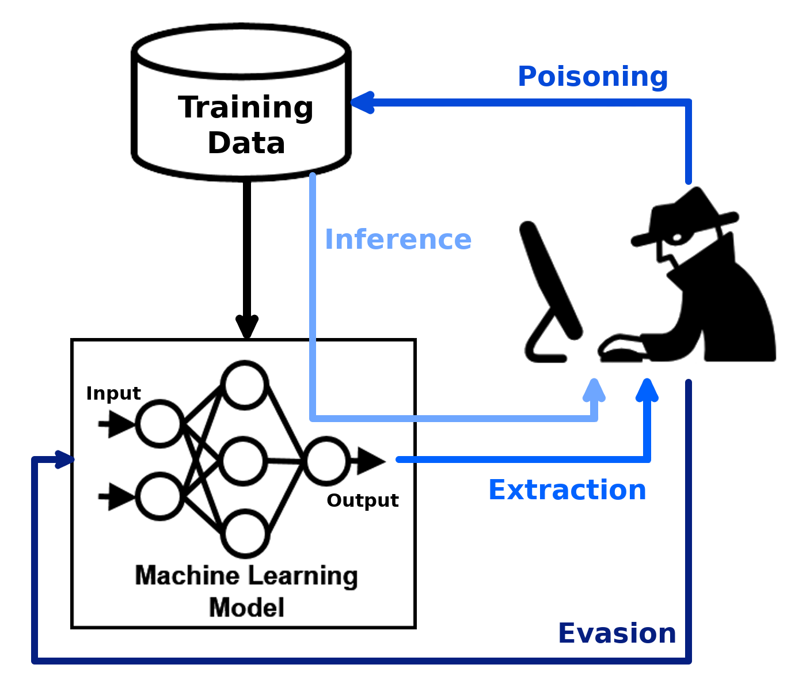

.. adversarial-robustness-toolbox documentation master file, created by
   sphinx-quickstart on Fri Mar 23 17:02:19 2018.
   You can adapt this file completely to your liking, but it should at least
   contain the root `toctree` directive.

Welcome to the Adversarial Robustness Toolbox
=============================================

Adversarial Robustness Toolbox (ART) is a Python library for Machine Learning Security. ART provides tools that enable
developers and researchers to evaluate, defend, certify and verify Machine Learning models and applications against
the adversarial threats of Evasion, Poisoning, Extraction, and Inference. ART supports all popular machine learning
frameworks (TensorFlow, Keras, PyTorch, MXNet, scikit-learn, XGBoost, LightGBM, CatBoost, GPy, etc.), all data types
(images, tables, audio, video, etc.) and machine learning tasks (classification, object detection, generation,
certification, etc.).

The code of ART is on `GitHub`_ and the Wiki contains overviews of implemented `attacks`_, `defences`_ and `metrics`_.

The library is under continuous development. Feedback, bug reports and contributions are very welcome!

Supported Machine Learning Libraries
------------------------------------

* TensorFlow (v1 and v2) (https://www.tensorflow.org)
* Keras (https://www.keras.io)
* PyTorch (https://www.pytorch.org)
* MXNet (https://mxnet.apache.org)
* Scikit-learn (https://www.scikit-learn.org)
* XGBoost (https://www.xgboost.ai)
* LightGBM (https://lightgbm.readthedocs.io)
* CatBoost (https://www.catboost.ai)
* GPy (https://sheffieldml.github.io/GPy/)

.. toctree::
   :maxdepth: 2
   :caption: User guide

   guide/setup
   guide/examples
   guide/notebooks

.. toctree::
   :maxdepth: 2
   :caption: Modules

   modules/attacks
   modules/attacks/evasion
   modules/attacks/extraction
   modules/attacks/inference/attribute_inference
   modules/attacks/inference/membership_inference
   modules/attacks/inference/model_inversion
   modules/attacks/inference/reconstruction
   modules/attacks/poisoning
   modules/defences
   modules/defences/detector_evasion
   modules/defences/detector_evasion_subsetscanning
   modules/defences/detector_poisoning
   modules/defences/postprocessor
   modules/defences/preprocessor
   modules/defences/trainer
   modules/defences/transformer_evasion
   modules/defences/transformer_poisoning
   modules/estimators
   modules/estimators/certification
   modules/estimators/certification_randomized_smoothing
   modules/estimators/classification
   modules/estimators/classification_scikitlearn
   modules/estimators/encoding
   modules/estimators/generation
   modules/estimators/object_detection
   modules/estimators/poison_mitigation_neural_cleanse
   modules/estimators/poison_mitigation_strip
   modules/estimators/regression
   modules/estimators/speech_recognition
   modules/evaluations
   modules/metrics
   modules/preprocessing
   modules/preprocessing/audio
   modules/preprocessing/expectation_over_transformation
   modules/preprocessing/standardisation_mean_std
   modules/data_generators
   modules/exceptions
   modules/utils
   modules/tests/utils

Indices and Tables
==================

* :ref:`genindex`
* :ref:`modindex`
* :ref:`search`

.. _GitHub: https://github.com/Trusted-AI/adversarial-robustness-toolbox
.. _attacks: https://github.com/Trusted-AI/adversarial-robustness-toolbox/wiki/ART-Attacks
.. _defences: https://github.com/Trusted-AI/adversarial-robustness-toolbox/wiki/ART-Defences
.. _metrics: https://github.com/Trusted-AI/adversarial-robustness-toolbox/wiki/ART-Metrics
